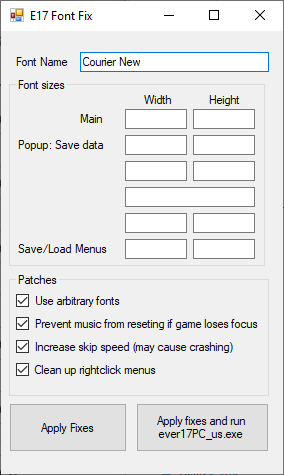

# Ever17 Exe Modifier

Allow the player to modify the English release of [Ever17: The Out of Infinity](https://vndb.org/v17) to do the following:
- Edit which font is used (monospaced font)
- Prevent the music from resetting if the game loses focus
- Increase skip speed
- Clean up the right click menu

Must be placed in the same folder as `ever17PC_us.exe`

Precompiled binaries can be found in [Releases](https://github.com/arsym-dev/Ever17-Exe-Modifier/releases).

